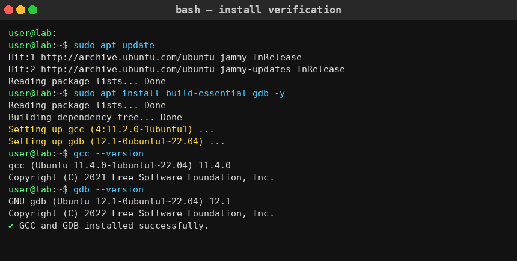
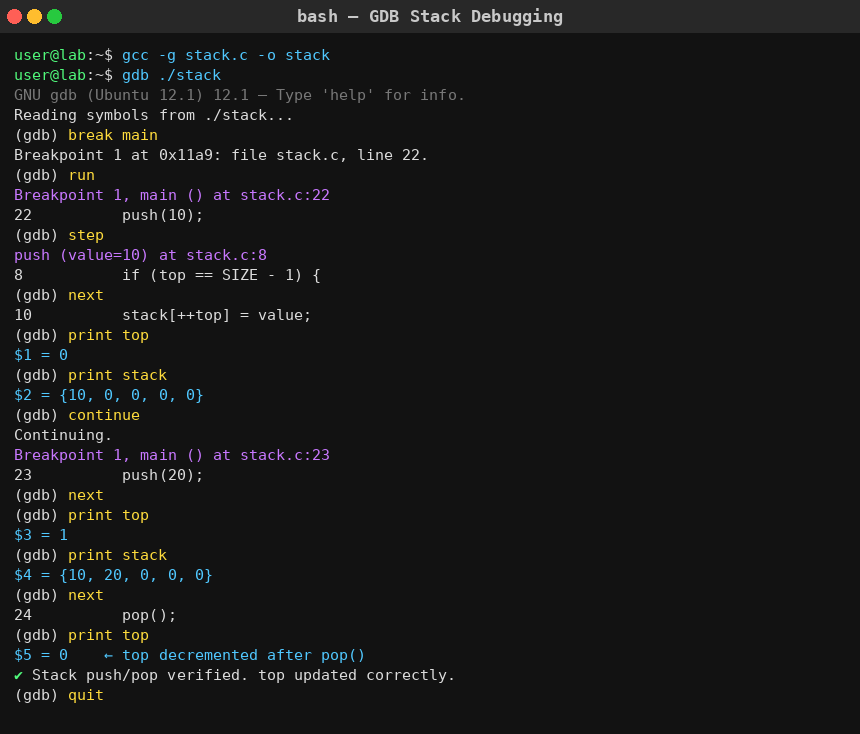
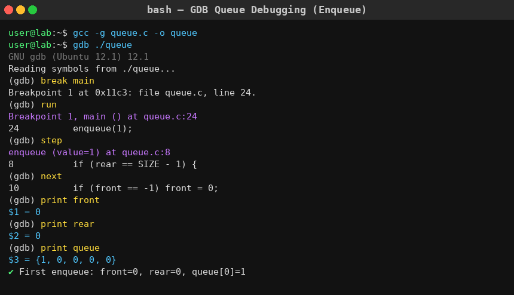
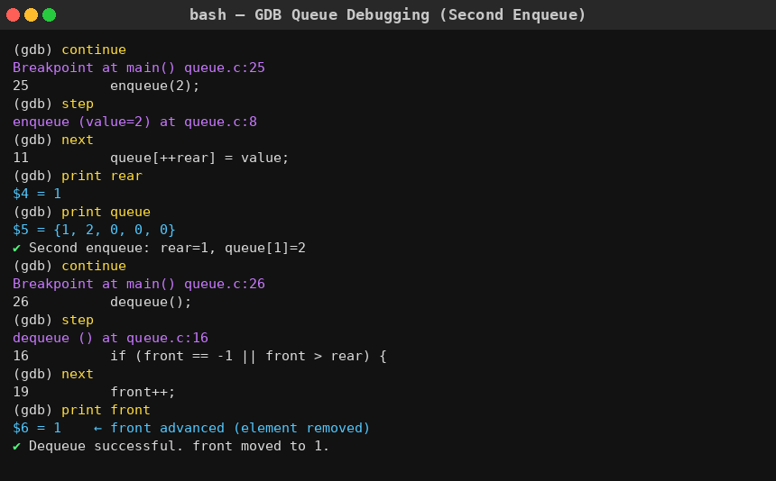
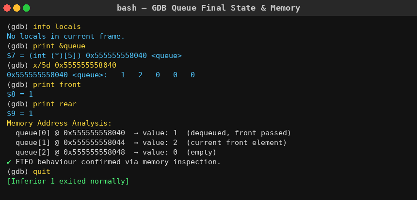
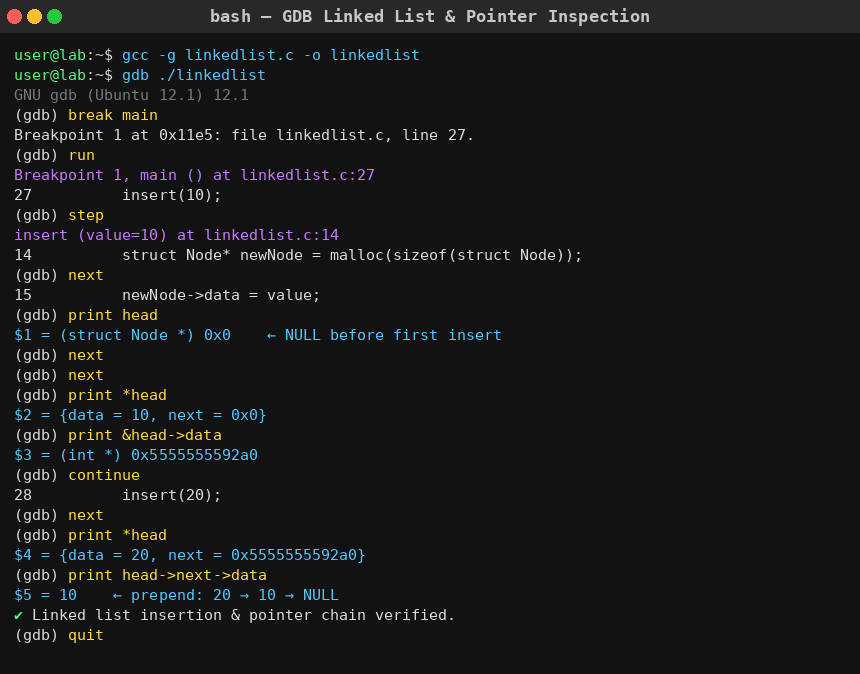

# Experiment 03: GDB Debugger — Program Execution & Memory Address Analysis

## Objective

This lab focuses on compiling C programs using GDB (GNU Debugger) to observe program execution in computer memory. It helps understand:

* Basic GDB commands
* Step-by-step execution tracing
* Memory address inspection for Stack, Queue, and Linked List
* How data structures behave internally during runtime

---

## Background Study

The **GNU Debugger (GDB)** is a powerful tool used to debug programs written in C and C++. It allows programmers to:

* Execute programs line-by-line
* Set breakpoints to pause execution
* Inspect variable values and memory addresses
* Trace function calls and logic flow

For debugging, programs must be compiled with the `-g` flag, which includes debugging symbols.

---

### Key Concepts

* **Breakpoint**: A point where execution pauses for inspection
* **Step Execution**:
  * `next`: Executes the next line (stays in current function)
  * `step`: Steps into a called function
* **Variable Inspection**:
  * `print variable` — shows current value
  * `print &variable` — shows memory address
  * `x/Nd address` — examines N raw values at a memory address
* **Memory Address Indexing**: Each variable/array element occupies contiguous addresses in RAM (4 bytes for `int`)

---

### Data Structures Used

* **Stack (LIFO)**: Last In First Out — tracked via `top`
* **Queue (FIFO)**: First In First Out — tracked via `front` and `rear`
* **Linked List**: Dynamic memory using heap pointers — tracked via `head`

---

## Setup

```bash
sudo apt update
sudo apt install build-essential gdb
```

### Verify Installation

```bash
gcc --version
gdb --version
```



---

## Compile Programs with Debug Symbols

**For Ubuntu/Linux:**
```bash
gcc -g filename.c -o output
```

**For Mac (M3/M4):**
```bash
gcc -g -gdwarf-4 filename.c -o output
```

**Examples:**
```bash
gcc -g stack.c -o stack
gcc -g queue.c -o queue
gcc -g linkedlist.c -o linkedlist
```

---

## Start GDB

```bash
gdb ./output
```

---

## Important GDB Commands

| Command              | Description                          |
| -------------------- | ------------------------------------ |
| `break main`         | Set breakpoint at main               |
| `break function_name`| Set breakpoint at a function         |
| `run`                | Start program execution              |
| `next`               | Execute next line (no step-in)       |
| `step`               | Step into function call              |
| `continue`           | Continue until next breakpoint       |
| `print variable`     | Print current value of variable      |
| `print &variable`    | Print memory address of variable     |
| `x/5d address`       | Examine 5 integers at memory address |
| `info locals`        | Show all local variables             |
| `info breakpoints`   | List all breakpoints                 |
| `quit`               | Exit GDB                             |

---

## Debugging Flow

```text
Compile (-g) → Open GDB → Set Breakpoint → Run → Step → Inspect Variables/Memory → Exit
```

---

# STACK IMPLEMENTATION

## Code (`stack.c`)

```c
#include <stdio.h>
#define SIZE 5

int stack[SIZE];
int top = -1;

void push(int value) {
    if (top == SIZE - 1) {
        printf("Stack Overflow\n");
        return;
    }
    stack[++top] = value;
    printf("Pushed %d | top = %d\n", value, top);
}

void pop() {
    if (top == -1) {
        printf("Stack Underflow\n");
        return;
    }
    printf("Popped %d | top = %d\n", stack[top], top - 1);
    top--;
}

void display() {
    if (top == -1) { printf("Stack is empty.\n"); return; }
    printf("Stack (top -> bottom): ");
    for (int i = top; i >= 0; i--) printf("%d ", stack[i]);
    printf("\n");
}

int main() {
    push(10);
    push(20);
    display();
    pop();
    display();
    return 0;
}
```

## GDB Session for Stack

```bash
gdb ./stack
break main
run
step          # enter push()
print top
print stack
continue
next          # after second push
print top
print stack
next          # pop()
print top     # should decrement
quit
```

### Lab Implementation



## Stack Flow

```text
PUSH(10) → stack[0]=10,  top=0
PUSH(20) → stack[1]=20,  top=1
POP()    → top=0         (20 removed)
```

---

# QUEUE IMPLEMENTATION

## Code (`queue.c`)

```c
#include <stdio.h>
#define SIZE 5

int queue[SIZE];
int front = -1, rear = -1;

void enqueue(int value) {
    if (rear == SIZE - 1) { printf("Overflow\n"); return; }
    if (front == -1) front = 0;
    queue[++rear] = value;
}

void dequeue() {
    if (front == -1 || front > rear) { printf("Underflow\n"); return; }
    front++;
}

int main() {
    enqueue(1);
    enqueue(2);
    dequeue();
    return 0;
}
```

## GDB Session for Queue

```bash
gdb ./queue
break main
run
step          # enter enqueue
print front
print rear
print queue
continue
step          # second enqueue
print rear
print queue
next          # dequeue
print front   # front advances
print &queue  # memory address of array
x/5d 0x<addr> # inspect 5 integers in memory
quit
```

### Lab Implementation







## Queue Flow

```text
ENQUEUE(1) → front=0, rear=0, queue[0]=1
ENQUEUE(2) → front=0, rear=1, queue[1]=2
DEQUEUE()  → front=1           (element at front removed, FIFO)

Memory (example):
  0x...040 → 1
  0x...044 → 2   ← current front (each int = 4 bytes apart)
  0x...048 → 0
```

---

# LINKED LIST IMPLEMENTATION

## Code (`linkedlist.c`)

```c
#include <stdio.h>
#include <stdlib.h>

struct Node {
    int data;
    struct Node* next;
};

struct Node* head = NULL;

void insert(int value) {
    struct Node* newNode = (struct Node*)malloc(sizeof(struct Node));
    newNode->data = value;
    newNode->next = head;
    head = newNode;
}

void display() {
    struct Node* temp = head;
    while (temp != NULL) {
        printf("%d -> ", temp->data);
        temp = temp->next;
    }
    printf("NULL\n");
}

int main() {
    insert(10);
    insert(20);
    display();
    return 0;
}
```

## GDB Session for Linked List

```bash
gdb ./linkedlist
break main
run
step          # enter insert(10)
print head    # NULL initially
next
next
print *head   # {data=10, next=0x0}
print &head->data   # heap memory address
continue
step          # insert(20)
print *head   # {data=20, next=<addr of 10's node>}
print head->next->data   # should print 10
quit
```

### Lab Implementation



## Linked List Flow

```text
insert(10) → head → [10 | NULL]
insert(20) → head → [20 | •] → [10 | NULL]   (prepend)

Pointer chain visible in GDB:
  head = 0x...2b0  → data=20, next=0x...2a0
  *head->next      → data=10, next=NULL
```

---

# RESULT

Successfully compiled all programs using:

```bash
gcc -g -o output filename.c
```

Executed inside GDB and observed:

* **Stack**: `top` correctly incremented on push, decremented on pop; memory addresses contiguous
* **Queue**: `front` and `rear` updated correctly; raw memory inspected using `x/5d`
* **Linked List**: `head` pointer updated on each insert; heap addresses of nodes traced with `print &head->data` and `print *head`

Memory address analysis confirmed:
* Array elements (Stack, Queue) are stored at contiguous addresses, spaced 4 bytes apart (for `int`)
* Linked List nodes are heap-allocated at non-contiguous addresses, connected by pointers

---

# CONCLUSION

* GDB is an essential tool for analyzing program execution at the memory level.
* It provides deep insight into execution flow, variable states, and heap/stack memory.
* Through this experiment:
  * Practical debugging experience was gained for all three data structures
  * Memory address indexing was visualized directly in the debugger
  * Logical errors can be identified and fixed using breakpoints and step execution
* GDB enhances **program reliability and developer productivity** through systematic, memory-level debugging.

---
